# Laboratorio Práctico
# DevOps Moderno con GitHub Actions y Azure DevOps
## Automatización Real de Empaquetado, Pruebas y Despliegue en Azure Cloud

---

## Descripción General

Este laboratorio tuvo como objetivo experimentar un escenario DevOps cercano a la vida real, implementando automatización de integración continua y despliegue continuo sobre infraestructura en la nube.

La práctica consistió en desarrollar una aplicación dummy basada en **Python Flask**, versionarla en **GitHub**, automatizar pruebas y empaquetado mediante **GitHub Actions**, y desplegarla en una **máquina virtual Ubuntu 24.04 LTS en Microsoft Azure**, exponiendo el servicio públicamente mediante el puerto `8080`.

El flujo implementado permite pasar desde el código fuente hasta una aplicación disponible públicamente en una VM Linux, siguiendo una arquitectura básica de CI/CD.

---

## Objetivos del Laboratorio

Al finalizar esta actividad se logró:

- Comprender los fundamentos de DevOps y automatización CI/CD.
- Utilizar GitHub Actions como plataforma principal de automatización.
- Automatizar pruebas, empaquetado y ejecución de pipelines.
- Desplegar una aplicación Python Flask en una VM Ubuntu en Azure.
- Integrar control de versiones con pipelines automatizados.
- Aplicar buenas prácticas básicas de infraestructura y automatización.
- Documentar técnicamente el proceso de implementación.
- Implementar un flujo inicial de CI/CD sobre una aplicación dummy de referencia.

---

## Escenario de Vida Real

### Contexto empresarial

El escenario simula una pequeña empresa que posee un portal o servicio web institucional desarrollado con tecnologías simples como HTML, NodeJS o Python Flask.

Antes de aplicar DevOps, el proceso de trabajo era manual:

- Los cambios se realizaban directamente sobre el servidor.
- El despliegue requería conectarse por SSH.
- No existían pruebas automáticas.
- No había trazabilidad formal de despliegues.
- No existía un pipeline automatizado.

Para modernizar este flujo, se implementó una solución DevOps basada en GitHub Actions y Azure.

---

## Reto del Laboratorio

Durante el laboratorio se realizaron las siguientes tareas:

1. Creación de un repositorio GitHub.
2. Configuración de pipelines CI/CD mediante GitHub Actions.
3. Automatización de:
   - Validación del código.
   - Ejecución de pruebas básicas.
   - Empaquetado de la aplicación.
   - Despliegue hacia una VM Ubuntu.
4. Despliegue de la aplicación en una VM Ubuntu en Azure.
5. Exposición pública del servicio mediante el puerto `8080`.
6. Documentación del proceso en Markdown.

---

## Arquitectura Simplificada

```text
Developer
   ↓ git push
Repositorio GitHub
   ↓
GitHub Actions Pipeline
   ↓
Pruebas automáticas
   ↓
Empaquetado / Validación
   ↓
Despliegue por SSH
   ↓
VM Ubuntu en Azure
   ↓
Aplicación disponible públicamente
```

---

## Tecnologías Utilizadas

### Plataforma DevOps principal

Se utilizó **GitHub Actions** como plataforma principal de automatización CI/CD.

### Plataforma alternativa

La consigna menciona **Azure DevOps Pipelines** como alternativa o desafío comparativo. En esta implementación se decidió utilizar GitHub Actions, ya que permite integrar directamente el repositorio, los workflows y la ejecución del pipeline dentro de GitHub.

### Aplicación dummy seleccionada

Se seleccionó la opción:

**Dummy B — API mínima con Python Flask**

La aplicación implementada expone:

- `/` → responde `Hola Mundo DevOps`
- `/health` → responde `OK` con código HTTP `200`

---

## Infraestructura Implementada

La infraestructura creada en Azure fue la siguiente:

- Grupo de recursos: `rg-lab-devops`
- Región: `South Brazil`
- Máquina virtual: `vm-devops`
- Sistema operativo: `Ubuntu 24.04 LTS`
- Usuario SSH: `azureuser`
- Acceso mediante clave `.pem`
- IP pública: `20.226.34.223`
- Puertos habilitados en el NSG:
  - `22` para SSH
  - `80` para HTTP
  - `8080` para la aplicación Flask

### Evidencias de infraestructura

#### Evidencia 01 — Resource Group creado

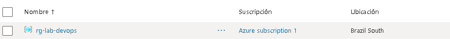

#### Evidencia 02 — Configuración inicial de la VM

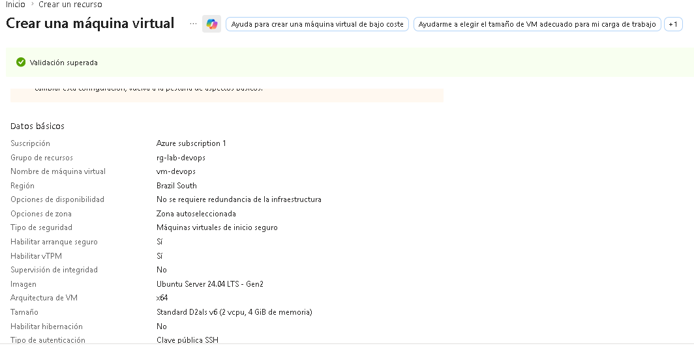

#### Evidencia 03 — VM creada correctamente

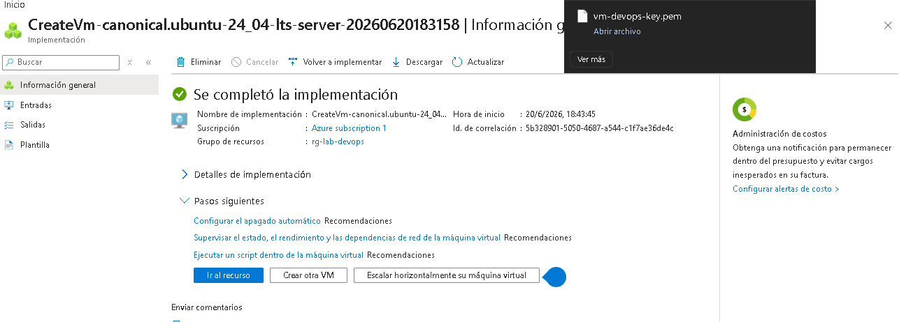

#### Evidencia 04 — IP pública asignada

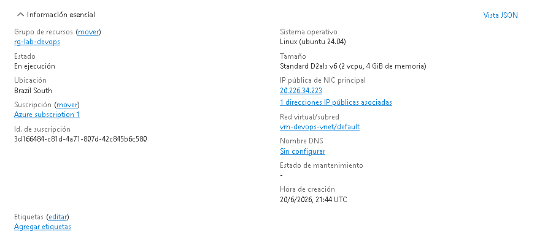

#### Evidencia 05 — Conexión SSH funcionando

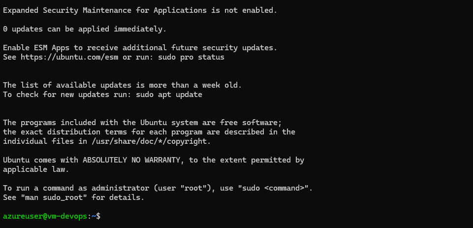

#### Evidencia 06 — Python instalado en la VM

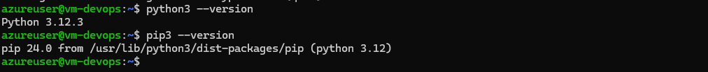

---

# PRE-LAB — Investigación y Spike Técnico

## Parte 1 — Introducción a DevOps

### ¿Qué es DevOps?

DevOps es una cultura y conjunto de prácticas que busca integrar el trabajo de desarrollo de software y operaciones de infraestructura. Su objetivo principal es entregar software de forma más rápida, confiable y repetible mediante automatización, colaboración y mejora continua.

DevOps no es solamente una herramienta, sino una forma de trabajo donde equipos, procesos y tecnología se alinean para reducir errores manuales, mejorar la calidad y acelerar la entrega de valor.

### Diferencia entre CI y CD

**CI**, o Integración Continua, consiste en integrar cambios de código frecuentemente en un repositorio compartido. Cada cambio dispara validaciones automáticas como instalación de dependencias, pruebas y construcción del proyecto.

**CD**, o Entrega/Despliegue Continuo, consiste en automatizar el proceso posterior a CI. Una vez que el código fue probado correctamente, puede ser empaquetado y desplegado hacia un ambiente de destino, como una VM, un servidor web o un entorno cloud.

En este laboratorio:

- CI se implementó con pruebas automáticas usando `pytest` y generación de artifact.
- CD se implementó mediante conexión SSH hacia una VM Ubuntu en Azure.

### Beneficios de la automatización

La automatización permite:

- Reducir errores humanos.
- Acelerar entregas.
- Aumentar la trazabilidad.
- Estandarizar despliegues.
- Facilitar la repetición del proceso.
- Detectar errores temprano.
- Mejorar la confiabilidad del software.

### ¿Qué es un pipeline?

Un pipeline es un conjunto ordenado de pasos automatizados que se ejecutan ante un evento, por ejemplo un `git push`. Un pipeline puede incluir tareas como descargar el código, instalar dependencias, ejecutar pruebas, crear paquetes y desplegar la aplicación.

En este laboratorio se crearon dos workflows principales:

- `ci.yml` para integración continua.
- `cd.yml` para despliegue continuo.

### ¿Qué es Infrastructure as Code?

Infrastructure as Code, o IaC, es una práctica que permite definir infraestructura mediante archivos de configuración o código. En lugar de crear recursos manualmente desde un portal gráfico, la infraestructura puede definirse en herramientas como Terraform, Bicep, ARM Templates o Ansible.

En este laboratorio la infraestructura se creó principalmente desde Azure Portal, pero se reconoce que en un entorno empresarial sería recomendable automatizar la creación de la VM, red y reglas de seguridad mediante IaC.

### ¿Qué es un despliegue automatizado?

Un despliegue automatizado es el proceso mediante el cual una aplicación se publica en un ambiente destino sin intervención manual directa. Normalmente se ejecuta desde un pipeline que copia archivos, instala dependencias, reinicia servicios y valida que la aplicación esté disponible.

En este laboratorio, el despliegue se realizó hacia una VM Ubuntu utilizando SSH y GitHub Actions.

---

## Parte 2 — Investigación de Plataformas

| Plataforma | Características |
|---|---|
| GitHub Actions | Plataforma CI/CD integrada con GitHub. Permite ejecutar workflows definidos en YAML ante eventos como `push`, `pull_request` o ejecución de otros workflows. Fue la plataforma utilizada en este laboratorio. |
| Azure DevOps | Plataforma empresarial de Microsoft que incluye Azure Repos, Azure Pipelines, Boards, Artifacts y Test Plans. Permite gestionar proyectos completos de desarrollo y despliegue. |
| GitLab CI/CD | Solución CI/CD integrada dentro de GitLab. Permite definir pipelines en `.gitlab-ci.yml` y manejar repositorios, issues, runners y despliegues desde una misma plataforma. |
| Bitbucket Pipelines | Servicio CI/CD integrado con Bitbucket y el ecosistema Atlassian. Permite automatizar builds y despliegues mediante archivos YAML. |

---

## Parte 3 — Investigación Técnica Base

### ¿Qué es YAML?

YAML es un formato de serialización de datos legible para humanos. Se utiliza frecuentemente para archivos de configuración. En DevOps se usa para definir pipelines, workflows, manifiestos de Kubernetes y configuraciones de infraestructura.

En este laboratorio se utilizó YAML para definir los archivos:

```text
.github/workflows/ci.yml
.github/workflows/cd.yml
```

### ¿Qué es un runner o agente?

Un runner o agente es la máquina que ejecuta los pasos definidos en un pipeline. En GitHub Actions, por ejemplo, `ubuntu-latest` indica que el workflow se ejecutará en una máquina Linux temporal administrada por GitHub.

### ¿Qué es un workflow?

Un workflow es una definición automatizada de tareas dentro de GitHub Actions. Se escribe en YAML y se guarda dentro de:

```text
.github/workflows/
```

Un workflow puede dispararse por eventos como `push`, `pull_request` o `workflow_run`.

### ¿Qué es un artifact?

Un artifact es un archivo o conjunto de archivos generados durante la ejecución de un pipeline y almacenados como resultado del proceso. Puede ser un paquete `.zip`, `.tar.gz`, binario compilado, reporte de pruebas o cualquier archivo necesario para etapas posteriores.

En este laboratorio el CI generó el archivo:

```text
app.tar.gz
```

como artifact del pipeline.

### ¿Qué es SSH?

SSH, o Secure Shell, es un protocolo seguro que permite conectarse remotamente a un servidor Linux. En este laboratorio se utilizó SSH para administrar la VM Ubuntu y para que el pipeline pudiera copiar archivos y ejecutar comandos remotos.

### ¿Qué es un deployment?

Un deployment es el proceso de publicar una aplicación en un ambiente destino. Puede ser manual o automatizado. En este laboratorio el deployment consistió en copiar la aplicación Flask a la VM Ubuntu y ejecutarla en el puerto `8080`.

### ¿Qué es un secreto o variable segura?

Un secreto es un valor sensible almacenado de forma segura dentro de una plataforma CI/CD. Puede contener contraseñas, claves SSH, tokens o credenciales de acceso.

En este laboratorio se utilizaron secretos de GitHub Actions para almacenar:

```text
VM_HOST
VM_USER
VM_KEY
```

Estos secretos permitieron que el pipeline se conectara a la VM sin exponer la clave privada en el repositorio.

---

# Desarrollo del Laboratorio

## Parte 1 — Crear Repositorio

Se creó un repositorio en GitHub para alojar el código fuente, los workflows de GitHub Actions y las evidencias del laboratorio.

La estructura principal del proyecto fue:

```text
lab-devops/
├── .github/
│   └── workflows/
│       ├── ci.yml
│       └── cd.yml
├── app/
│   ├── app.py
│   ├── requirements.txt
│   └── test_app.py
├── evidencias/
├── README.md
└── INFORME.md
```

### Evidencia 07 — Repositorio GitHub creado

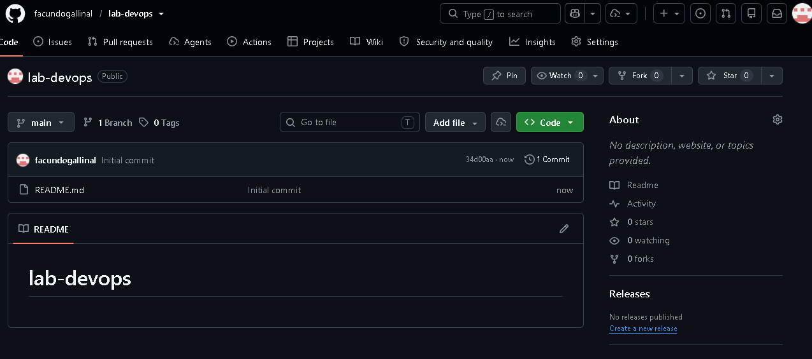

### Evidencia 08 — Estructura del proyecto

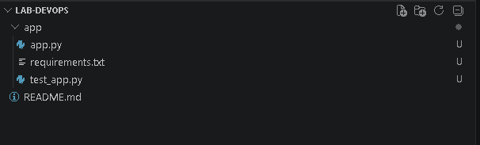

---

## Parte 2 — Crear Aplicación Base

Se implementó una aplicación mínima utilizando Python Flask.

Archivo principal:

```text
app/app.py
```

Código principal:

```python
from flask import Flask

app = Flask(__name__)

@app.route("/")
def home():
    return "Hola Mundo DevOps"

@app.route("/health")
def health():
    return "OK", 200

if __name__ == "__main__":
    app.run(host="0.0.0.0", port=8080)
```

Dependencias del proyecto:

```text
flask
pytest
```

Archivo de prueba:

```text
app/test_app.py
```

Prueba implementada:

```python
from app import app

def test_health():
    client = app.test_client()
    response = client.get("/health")
    assert response.status_code == 200
```

### Prueba local de la aplicación

La aplicación fue ejecutada localmente y se validaron los endpoints:

```text
http://localhost:8080
http://localhost:8080/health
```

### Evidencia 09 — Aplicación local funcionando

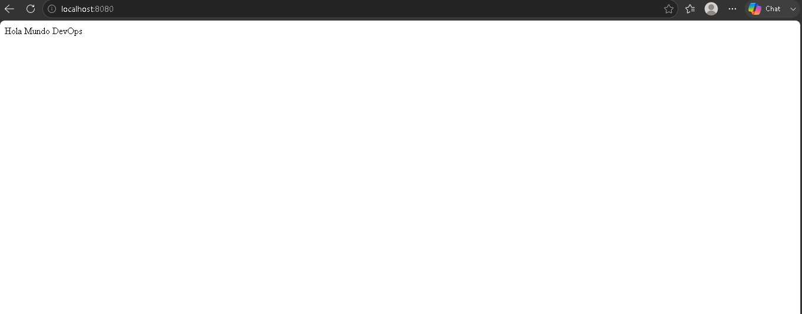

### Evidencia 09b — Flask ejecutándose localmente

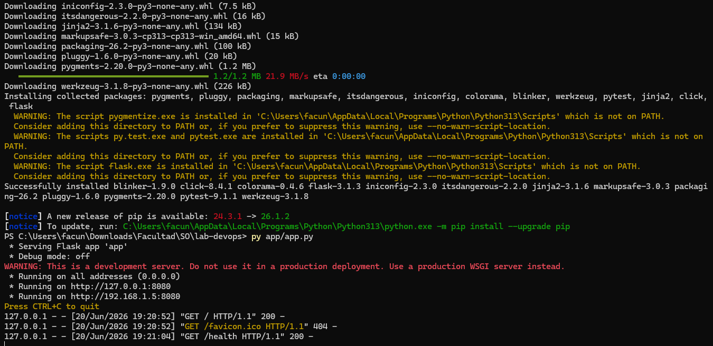

### Evidencia 10 — Endpoint health local

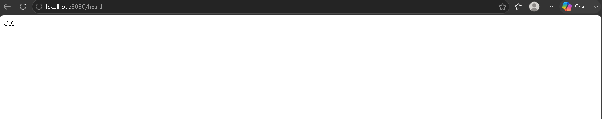

---

## Control de versiones con Git

Luego de crear la aplicación, se agregaron los archivos al repositorio utilizando Git.

Comandos utilizados:

```bash
git add .
git commit -m "Aplicacion Flask inicial"
git push origin main
```

### Evidencia 11 — Archivos agregados con Git

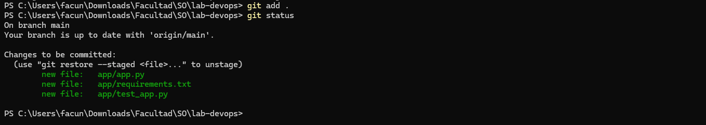

### Evidencia 12 — Commit inicial

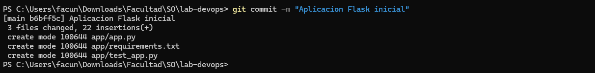

### Evidencia 13 — Código subido a GitHub

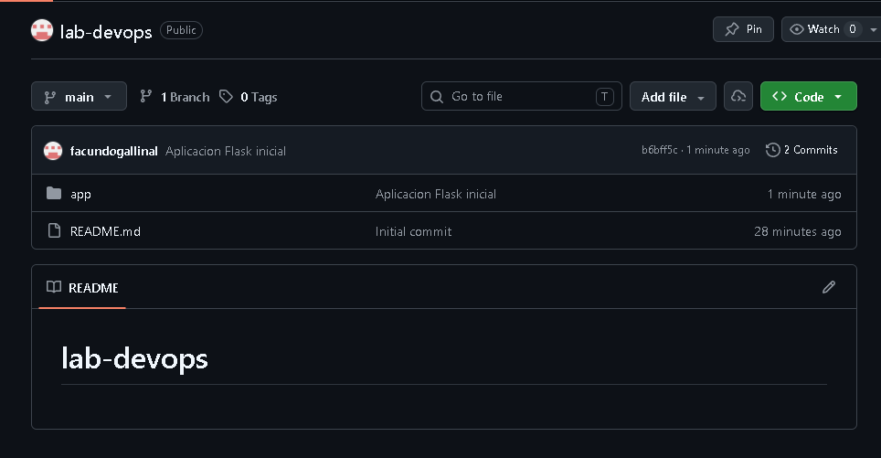

---

## Parte 3 — Configurar CI

Se configuró un pipeline de integración continua utilizando GitHub Actions.

Archivo creado:

```text
.github/workflows/ci.yml
```

El workflow se ejecuta ante:

- `push`
- `pull_request`

Tareas automatizadas por el CI:

1. Descargar el código del repositorio.
2. Instalar Python.
3. Instalar dependencias desde `requirements.txt`.
4. Ejecutar pruebas con `pytest`.
5. Crear un paquete `app.tar.gz`.
6. Publicar el paquete como artifact.

Contenido del pipeline CI:

```yaml
name: CI

on:
  push:
  pull_request:

jobs:
  build-test:

    runs-on: ubuntu-latest

    steps:

      - name: Checkout
        uses: actions/checkout@v4

      - name: Setup Python
        uses: actions/setup-python@v5
        with:
          python-version: "3.12"

      - name: Install dependencies
        run: |
          pip install -r app/requirements.txt

      - name: Run tests
        run: |
          pytest app

      - name: Create Artifact
        run: |
          tar -czf app.tar.gz app

      - name: Upload Artifact
        uses: actions/upload-artifact@v4
        with:
          name: flask-app
          path: app.tar.gz
```

### Evidencia 14 — Archivo ci.yml

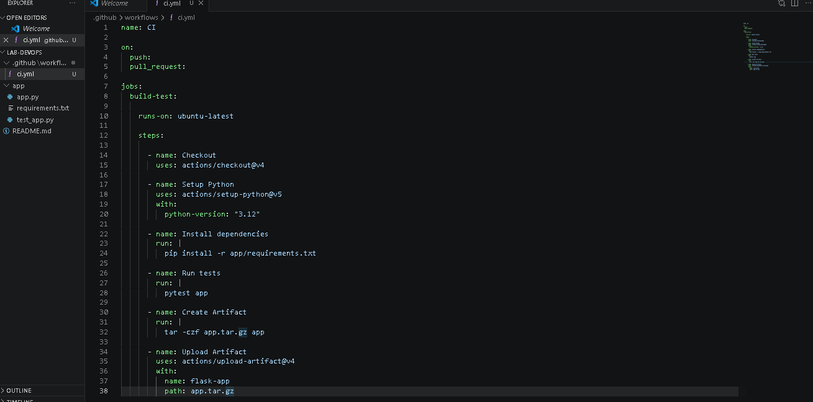

### Evidencia 15 — Pipeline ejecutándose

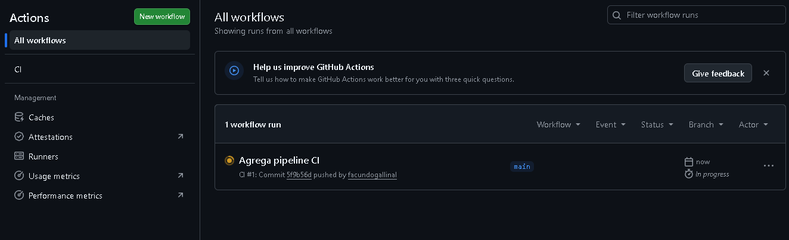

### Evidencia 16 — CI ejecutado correctamente

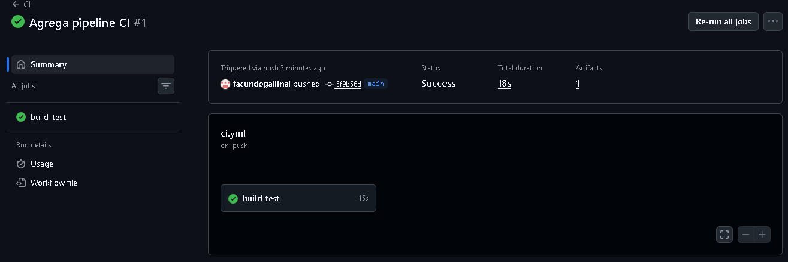

---

## Parte 4 — Configurar CD

Para el despliegue continuo se utilizó una VM Ubuntu en Azure y conexión SSH desde GitHub Actions.

Primero se creó el directorio de despliegue en la VM:

```bash
mkdir ~/deploy
```

### Evidencia 17 — Directorio deploy creado

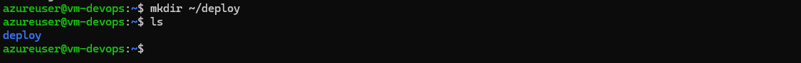

Luego se configuraron secretos en GitHub Actions para permitir la conexión segura a la VM:

```text
VM_HOST
VM_USER
VM_KEY
```

### Evidencia 18 — Secretos configurados en GitHub

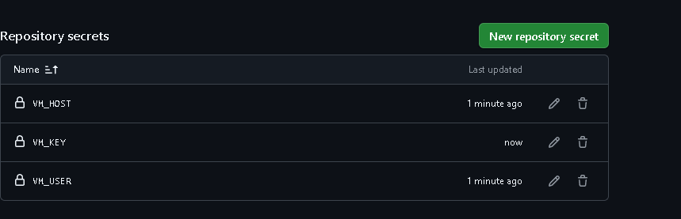

También se creó el script remoto de despliegue:

```text
~/deploy/deploy.sh
```

Contenido del script:

```bash
#!/bin/bash

cd ~/deploy

tar -xzf app.tar.gz

pkill -f app.py || true

nohup python3 app/app.py > flask.log 2>&1 &
```

### Evidencia 19 — Script de despliegue en la VM

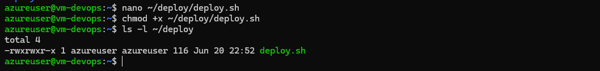

---

## Pipeline CD

Se creó el archivo:

```text
.github/workflows/cd.yml
```

La primera versión del CD intentaba descargar el artifact generado por el workflow CI. Luego se detectó un problema de acceso al artifact entre workflows separados, por lo que se corrigió el flujo para copiar directamente la aplicación desde el repositorio hacia la VM mediante `scp`.

### Evidencia 20 — Archivo cd.yml inicial

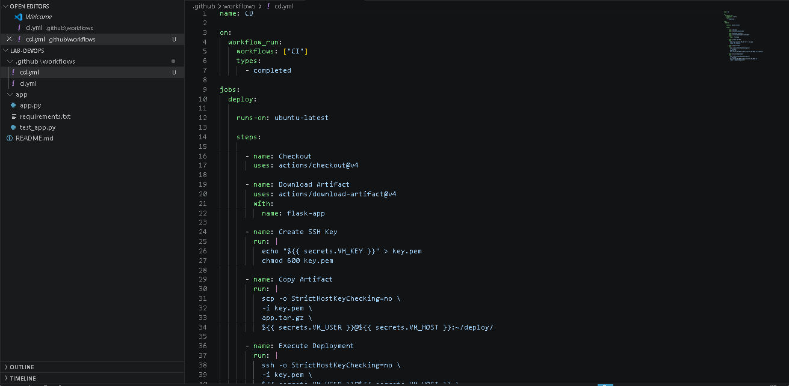

### Evidencia 21 — Commit del pipeline CD

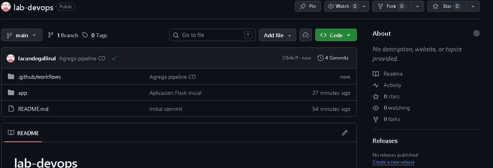

### Evidencia 22 — Error inicial del CD

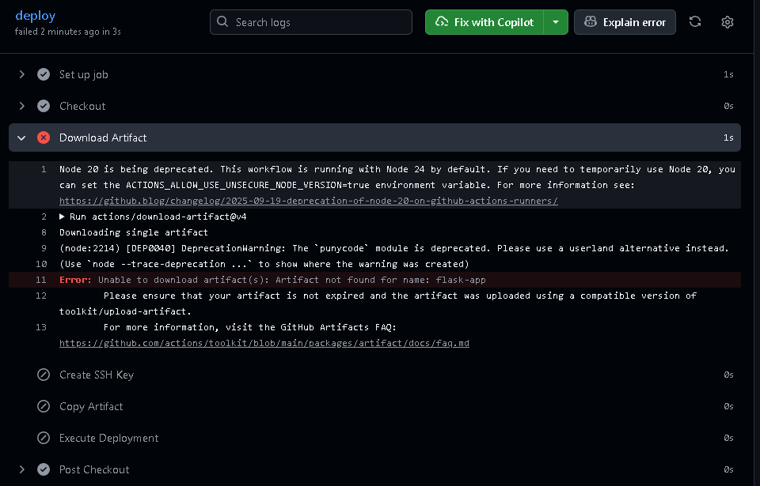

### Corrección aplicada al CD

El pipeline fue corregido para copiar la carpeta `app` directamente a la VM y ejecutar la aplicación mediante SSH.

Versión corregida del pipeline CD:

```yaml
name: CD

on:
  workflow_run:
    workflows: ["CI"]
    types:
      - completed

jobs:
  deploy:
    runs-on: ubuntu-latest

    steps:

      - name: Checkout
        uses: actions/checkout@v4

      - name: Create SSH Key
        run: |
          echo "${{ secrets.VM_KEY }}" > key.pem
          chmod 600 key.pem

      - name: Copy Application
        run: |
          scp -r \
          -o StrictHostKeyChecking=no \
          -i key.pem \
          app \
          ${{ secrets.VM_USER }}@${{ secrets.VM_HOST }}:~/deploy/

      - name: Execute Deployment
        run: |
          ssh -o StrictHostKeyChecking=no \
          -i key.pem \
          ${{ secrets.VM_USER }}@${{ secrets.VM_HOST }} \
          'pkill -f app.py || true && nohup python3 ~/deploy/app/app.py > ~/deploy/flask.log 2>&1 &'
```

### Evidencia 23 — CD corregido

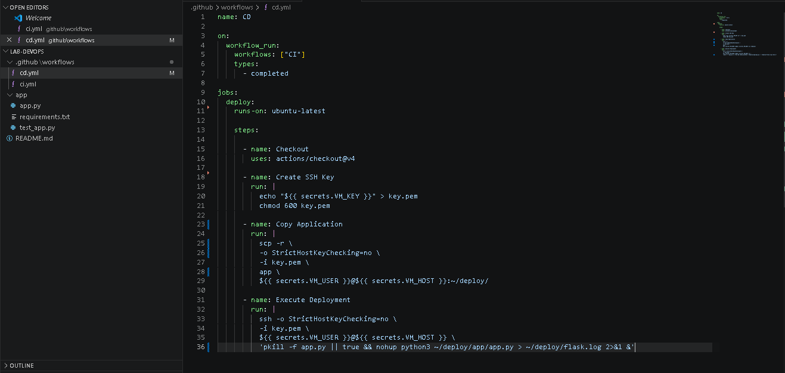

### Evidencia 24 — Commit del CD corregido

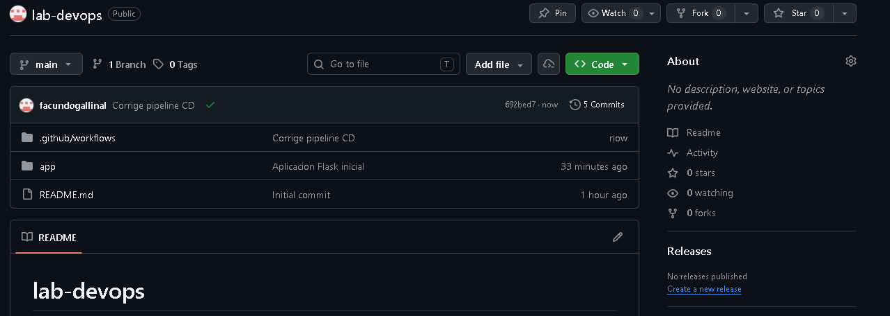

### Evidencia 25 — CD exitoso

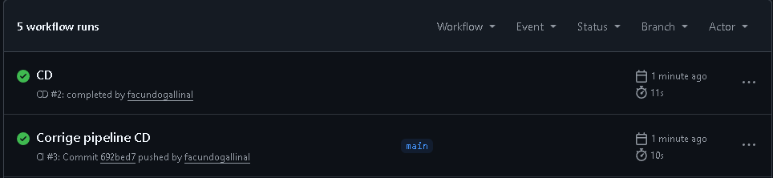

---

## Verificación del despliegue

Luego del despliegue, se verificó en la VM que los archivos estuvieran copiados correctamente dentro del directorio:

```text
/home/azureuser/deploy/app
```

### Evidencia 25b — Verificación de archivos desplegados

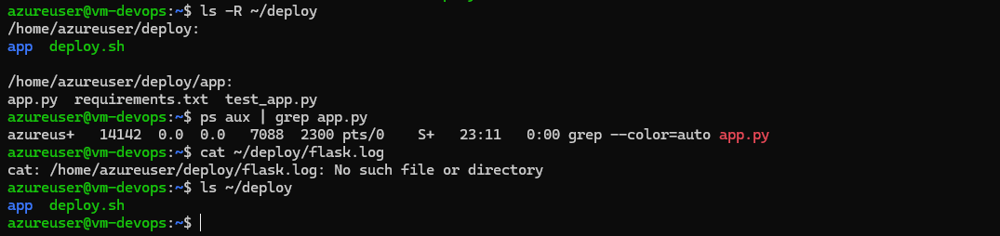

Durante la prueba de acceso público se detectó que el puerto `8080` no estaba habilitado inicialmente en las reglas de entrada del NSG de Azure. Se agregó una regla de entrada TCP para permitir el tráfico hacia el puerto `8080`.

### Evidencia 26 — Regla NSG para puerto 8080

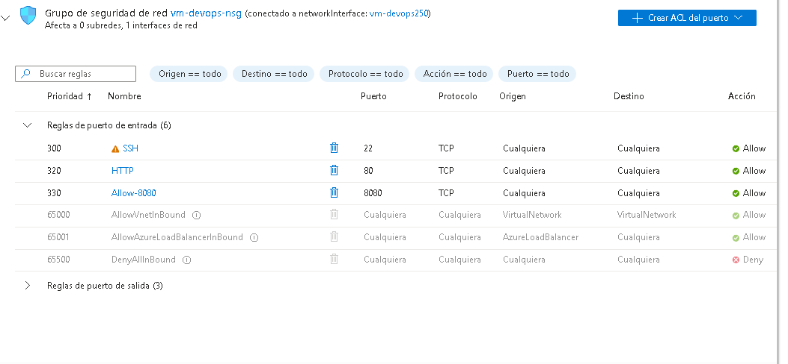

Finalmente se comprobó la disponibilidad pública de la aplicación.

### URL pública de la aplicación

```text
http://20.226.34.223:8080
```

### Endpoint de health check

```text
http://20.226.34.223:8080/health
```

### Evidencia 27 — Aplicación publicada en Azure

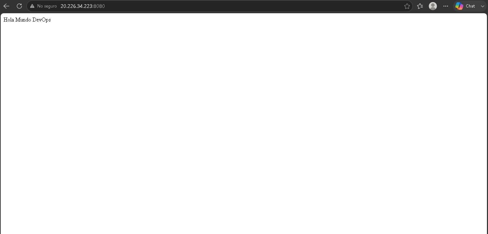

### Evidencia 28 — Endpoint health público

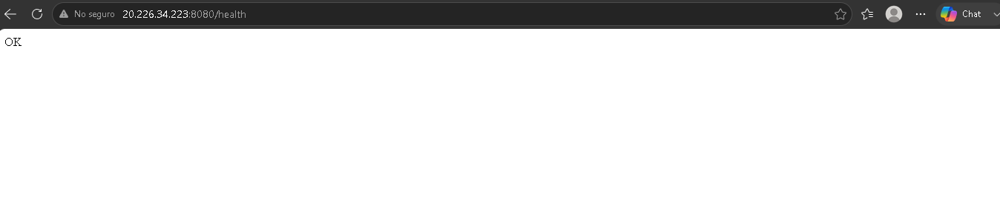

---

# Problemas Encontrados

Durante el laboratorio se presentaron los siguientes inconvenientes técnicos:

## 1. Error al descargar artifact en el workflow CD

El workflow CD intentó descargar el artifact `flask-app` generado por el pipeline CI, pero GitHub Actions devolvió el error:

```text
Artifact not found for name: flask-app
```

Esto ocurrió porque el artifact pertenecía a una ejecución separada del workflow CI y no estaba disponible directamente para el workflow CD con la configuración inicial.

## 2. Puerto 8080 no habilitado en Azure

Al probar la aplicación desde la IP pública, el navegador no pudo conectarse al puerto `8080`. Se identificó que el NSG de Azure tenía habilitados los puertos `22` y `80`, pero no el puerto `8080`.

## 3. Flask no estaba instalado en la VM

Al ejecutar la aplicación en la VM apareció el error:

```text
ModuleNotFoundError: No module named 'flask'
```

Esto indicó que Python estaba instalado, pero no las dependencias necesarias de la aplicación.

## 4. Restricción de instalación de paquetes en Ubuntu 24.04

Al intentar instalar Flask mediante `pip3 install flask`, Ubuntu 24.04 devolvió el error:

```text
externally-managed-environment
```

Esto se debe a que Ubuntu 24.04 restringe la instalación global de paquetes Python administrados externamente.

---

# Soluciones Aplicadas

## 1. Corrección del workflow CD

Se modificó el pipeline CD para evitar la descarga directa del artifact entre workflows. En su lugar, el workflow realiza un `checkout` del repositorio y copia la carpeta `app` hacia la VM mediante `scp`.

## 2. Apertura del puerto 8080

Se agregó una regla de entrada en el NSG de Azure:

```text
Protocolo: TCP
Puerto: 8080
Acción: Allow
Nombre: Allow-8080
```

Esto permitió acceder a la aplicación Flask desde Internet.

## 3. Instalación de dependencias en la VM

Se instalaron las dependencias necesarias en la VM. Debido a la política de Ubuntu 24.04, se utilizó:

```bash
pip3 install flask --break-system-packages
pip3 install pytest --break-system-packages
```

También se validó que una alternativa más adecuada para ambientes reales sería utilizar un entorno virtual con `python3 -m venv`.

## 4. Validación manual y pública del servicio

Luego de instalar Flask y abrir el puerto `8080`, se ejecutó la aplicación y se validó el acceso público desde el navegador.

---

# Resultado Esperado

El resultado final cumplió con el flujo propuesto:

```text
Código → Pipeline → Pruebas → Artifact → Deploy → Producción
```

La aplicación quedó disponible públicamente en Azure mediante:

```text
http://20.226.34.223:8080
```

Y el endpoint de salud respondió correctamente mediante:

```text
http://20.226.34.223:8080/health
```

---

# POST-LAB — Reflexión Técnica

## 1. ¿Qué ventajas ofrece DevOps frente al despliegue manual?

DevOps permite automatizar tareas repetitivas, reducir errores humanos y mejorar la velocidad de entrega. Frente al despliegue manual, un pipeline automatizado ofrece mayor consistencia, trazabilidad y control. Cada cambio queda asociado a un commit, una ejecución del pipeline y un resultado verificable.

Además, DevOps facilita detectar problemas antes de llegar a producción, ya que las pruebas automáticas se ejecutan cada vez que se realizan cambios en el repositorio.

## 2. ¿Qué problemas podrían ocurrir sin automatización?

Sin automatización podrían existir errores como copiar archivos incorrectos, olvidar instalar dependencias, reiniciar servicios de forma incorrecta o desplegar versiones no probadas. También sería más difícil saber qué versión está ejecutándose en el servidor y quién realizó un cambio.

La falta de automatización aumenta el riesgo de inconsistencias entre ambientes y puede hacer que los despliegues sean lentos, poco confiables y difíciles de auditar.

## 3. ¿Qué parte del pipeline fue más compleja?

La parte más compleja fue la configuración del despliegue continuo, especialmente la conexión SSH desde GitHub Actions hacia la VM y el manejo de artifacts entre workflows.

También surgieron dificultades relacionadas con la configuración de red en Azure, específicamente la habilitación del puerto `8080`, y con la instalación de dependencias Python en Ubuntu 24.04.

## 4. ¿Qué mejorarían en un ambiente empresarial real?

En un ambiente empresarial real se podrían implementar varias mejoras:

- Usar Docker para empaquetar la aplicación y sus dependencias.
- Crear la infraestructura con Terraform o Bicep.
- Ejecutar la aplicación como servicio `systemd` en lugar de usar `nohup`.
- Usar HTTPS con certificado TLS.
- Separar ambientes de desarrollo, testing y producción.
- Agregar monitoreo con Azure Monitor o Application Insights.
- Implementar rollback automático ante fallos.
- Usar entornos virtuales o contenedores para evitar instalar paquetes globalmente.

## 5. ¿Qué riesgos de seguridad identificaron?

Se identificaron los siguientes riesgos:

- Exposición de puertos públicos en la VM.
- Uso de claves SSH para automatización.
- Posible exposición accidental de secretos si no se almacenan correctamente.
- Falta de HTTPS en la aplicación pública.
- Ejecución de la aplicación Flask directamente, sin un servidor WSGI de producción.
- Uso de `StrictHostKeyChecking=no`, que simplifica el laboratorio pero no es lo más recomendable en producción.

Para mitigar estos riesgos en un entorno real, se deberían aplicar reglas de red más restrictivas, gestionar secretos con servicios especializados, utilizar HTTPS, ejecutar la aplicación detrás de NGINX y aplicar hardening del sistema operativo.

## 6. ¿Cómo escalarían esta solución?

La solución podría escalarse utilizando contenedores Docker y orquestación con Kubernetes o Azure Container Apps. También podría colocarse la aplicación detrás de un balanceador de carga y desplegar múltiples instancias.

Otra mejora sería separar la base de infraestructura mediante Infrastructure as Code, automatizar la creación de ambientes y utilizar estrategias de despliegue como blue-green deployment o rolling updates.

---

# Conclusiones

El laboratorio permitió implementar un flujo DevOps funcional desde el código hasta el despliegue en una VM Ubuntu en Azure. Se logró crear una aplicación Flask simple, versionarla en GitHub, ejecutar pruebas automáticas mediante GitHub Actions, generar un artifact y desplegar la aplicación en infraestructura cloud.

Durante el proceso se resolvieron problemas reales relacionados con artifacts, conectividad de red, instalación de dependencias y configuración de puertos. Estos inconvenientes permitieron comprender mejor el valor de la automatización y la importancia de documentar cada paso del proceso.

La implementación final demuestra un flujo básico pero funcional de CI/CD:

```text
GitHub → GitHub Actions → Pruebas → Despliegue SSH → Azure VM → Servicio público
```

Como mejora futura, se recomienda contenerizar la aplicación con Docker, ejecutar Flask mediante un servicio administrado, implementar HTTPS, automatizar la infraestructura con Terraform o Bicep y mejorar la estrategia de despliegue para entornos productivos.

---

# Entregables

## Repositorio GitHub

El repositorio contiene:

- Código fuente de la aplicación Flask.
- Archivos YAML de GitHub Actions.
- Scripts de despliegue.
- Evidencias del laboratorio.
- Informe técnico en Markdown.

## URL pública del servicio

```text
http://20.226.34.223:8080
```

## URL del health check

```text
http://20.226.34.223:8080/health
```
